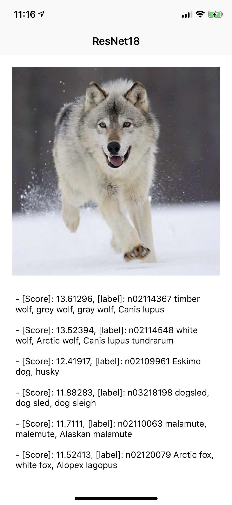

## Sat842

A simple image classification app based on ResNet18. Currently the code is only available on iOS devices.

### libtorch.a

All the `.a` files were generated via cmake based on the code on master branch of [Pytorch](https://github.com/pytorch/pytorch). As this is not the final stage of Pytorch, the libraries are too big to upload and therefore, are not ready for the production to use. I'll recompile and upload the missing libs later after the Facebook release the Pytorch 1.2.

### Demo

To run the demo on device,  an Apple developer account is required, other than that, just clone the code and everything should be compiled in XCode. The demo is just for testing purpose, feel free to open issues.

### Trouble Shooting

- Check to see the `header/lib search path` has been set properly accroding to your local environment
- For the testing purpose, we can simply add `-load_all` as a linker flag to load all the symbols in `.a`

### Screen Shot

